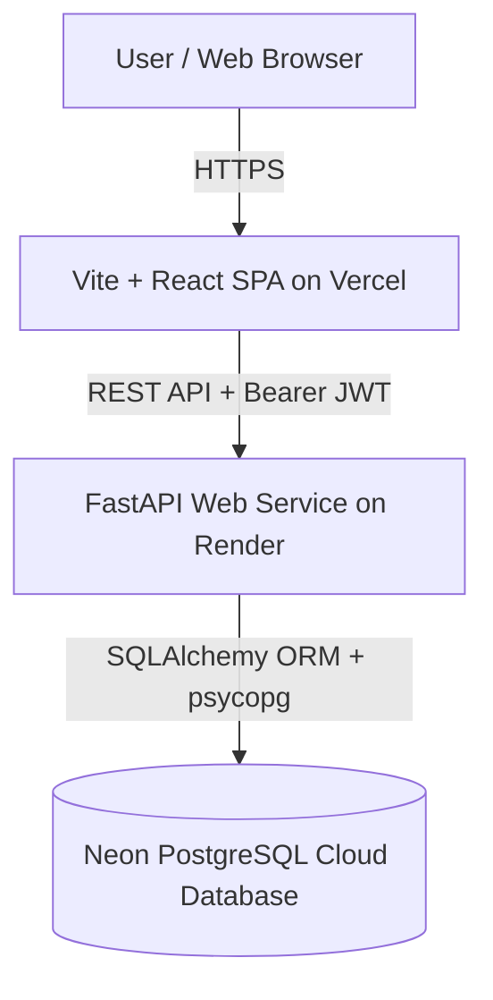
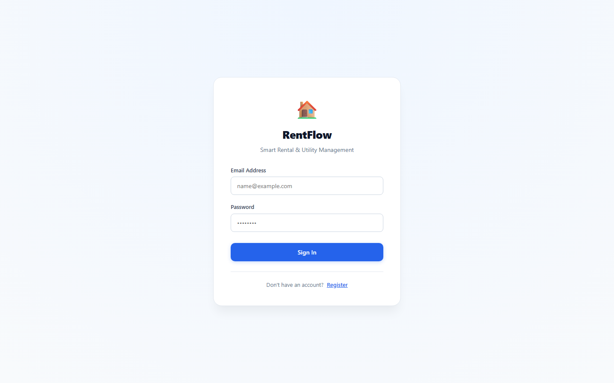

# RentFlow

> **Smart Rental & Utility Management**

RentFlow is a full-stack, production-ready web application designed for landlords and property managers to streamline property administration, tenant onboarding, rent collection, and utility bill tracking in real time.

---

## 🚀 Live Demo

- **Frontend Application (Vercel)**: [https://rentflow-gray-tau.vercel.app](https://rentflow-gray-tau.vercel.app)
- **Backend API (Render)**: [https://rentflow-kagw.onrender.com](https://rentflow-kagw.onrender.com)
- **API Health Check**: [https://rentflow-kagw.onrender.com/health](https://rentflow-kagw.onrender.com/health)

---

## 📌 Key Features

- 🏢 **Property Administration**: Manage multiple properties, addresses, units, and base monthly rent configurations.
- 👥 **Tenant Onboarding**: Link tenants to specific properties with move-in dates, contact info, and custom rent due dates.
- 💳 **Rent & Payment Tracking**: Auto-calculate payment status (`Paid`, `Pending`, `Overdue`), record payment methods (`UPI`, `Bank Transfer`, `Cash`), and generate one-click monthly rent invoices.
- ⚡ **Utility Expense Management**: Track tenant utility bills (Electricity, Water, Gas, Internet) with due dates, payment dates, and connection references.
- 📊 **Interactive Analytics Dashboard**: Visualize rent collection rates, pending balances, and total utility expenditures using interactive Recharts graphs.
- 📑 **Financial Reports**: Date-filtered reports by billing month with summary metrics and exportable views.
- 🔔 **In-App Reminders & Notifications**: Built-in notification center highlighting overdue payments, pending bills, and property status alerts.
- 🔒 **Secure Multi-User Data Isolation**: JWT authentication and strict row-level ownership protection ensuring each landlord accesses only their own records.

---

## 🛠 Tech Stack

### Frontend
- **Framework**: React 19 + Vite
- **Language**: JavaScript (ES6+)
- **Routing**: React Router v7
- **HTTP Client**: Axios with request/response interceptors
- **Visualizations**: Recharts
- **Icons**: Lucide React
- **Styling**: Vanilla CSS with modern CSS variables & responsive layouts

### Backend
- **Framework**: Python 3.11 + FastAPI
- **ORM**: SQLAlchemy 2.0
- **ASGI Server**: Uvicorn
- **Authentication**: PyJWT (Bearer Tokens)
- **Security**: bcrypt password hashing
- **Environment Management**: python-dotenv

### Database & Migrations
- **Database**: PostgreSQL (Neon Serverless) with `psycopg3` driver (Production) / SQLite (Local Dev)
- **Database Migrations**: Alembic

### Infrastructure & Deployment
- **Frontend Hosting**: Vercel (SPA with client-side rewrite rules)
- **Backend Hosting**: Render Web Service
- **Database Cloud**: Neon Serverless PostgreSQL

---

## 🏗 System Architecture



---

## 🔐 Security & Data Protection

- **JWT Authentication**: Secure token-based authentication with expiration claims.
- **Bcrypt Password Hashing**: Passwords are salted and hashed securely using bcrypt prior to database insertion.
- **Ownership Authorization**: Every query enforces `Property.user_id == current_user.id`, preventing cross-tenant or cross-user data leakage (returns `404 Not Found`).
- **Secret Isolation**: Secrets (`DATABASE_URL`, `JWT_SECRET_KEY`) are managed strictly via server environment variables and excluded from Git via `.gitignore`.
- **Sanitized API Errors**: Production exception handlers prevent raw database tracebacks or connection credentials from being exposed to clients.

---

## 🗄 Database Schema

RentFlow implements 5 relational entities in PostgreSQL:

- **`users`**: Landlord accounts (`id`, `name`, `email`, `hashed_password`, `created_at`).
- **`properties`**: Rental property listings (`id`, `name`, `address`, `unit_number`, `monthly_rent`, `user_id`).
- **`tenants`**: Tenant occupant profiles (`id`, `name`, `phone`, `rent_amount`, `rent_due_day`, `move_in_date`, `property_id`).
- **`payments`**: Rent collection records (`id`, `tenant_id`, `payment_type`, `amount`, `due_date`, `billing_month`, `payment_date`, `status`, `payment_method`, `reference`).
- **`utility_bills`**: Utility expenses (`id`, `tenant_id`, `utility_type`, `connection_number`, `amount`, `due_date`, `payment_date`, `status`, `notes`).

---

## 🔌 API Route Reference

### Auth
- `POST /auth/register` — Register a new landlord account.
- `POST /auth/login` — Authenticate credentials and receive a Bearer JWT.

### Properties
- `GET /properties/` — List all properties owned by authenticated user.
- `POST /properties/` — Create a new property listing.
- `GET /properties/{id}` — Get single property details.
- `PUT /properties/{id}` — Update property details.
- `DELETE /properties/{id}` — Delete property (fails if active tenants exist).

### Tenants
- `GET /tenants/` — List all tenants for authenticated user's properties.
- `POST /tenants/` — Create a tenant profile.
- `GET /tenants/{id}` — Get single tenant details.
- `PUT /tenants/{id}` — Update tenant details.
- `DELETE /tenants/{id}` — Delete tenant record.

### Payments
- `GET /payments/` — List payments (optional `?billing_month=YYYY-MM-01` filter).
- `POST /payments/` — Create a payment record.
- `GET /payments/{id}` — Get single payment details.
- `PUT /payments/{id}` — Update payment record.
- `POST /payments/{id}/pay` — Mark payment as Paid (sets payment date to today).
- `POST /payments/generate-monthly` — Generate monthly rent records for all active tenants.
- `DELETE /payments/{id}` — Delete payment record.

### Utility Bills
- `GET /utilities/` — List utility bills.
- `POST /utilities/` — Create utility bill entry.
- `GET /utilities/{id}` — Get single utility bill details.
- `PUT /utilities/{id}` — Update utility bill.
- `POST /utilities/{id}/pay` — Mark utility bill as Paid.
- `DELETE /utilities/{id}` — Delete utility bill.

### Health
- `GET /health` — Application health check endpoint (`{"status": "healthy"}`).

---

## ⚙️ Environment Variables

### Backend (`backend/.env`)
| Variable | Description |
| :--- | :--- |
| `DATABASE_URL` | PostgreSQL connection string (`postgresql+psycopg://...`) |
| `JWT_SECRET_KEY` | Secret key for signing JWT tokens |
| `JWT_ALGORITHM` | Algorithm used for JWT signing (`HS256`) |
| `ACCESS_TOKEN_EXPIRE_MINUTES` | Token validity duration in minutes (`30`) |
| `ALLOWED_ORIGINS` | Comma-separated CORS origins (e.g. `https://rentflow-gray-tau.vercel.app`) |

### Frontend (`frontend/.env.local`)
| Variable | Description |
| :--- | :--- |
| `VITE_API_BASE_URL` | Deployed backend API base URL (`https://rentflow-kagw.onrender.com`) |

---

## 💻 Local Development Setup

### Prerequisites
- Python 3.11+
- Node.js 18+
- Git

### 1. Backend Setup
```bash
# Navigate to backend directory
cd backend

# Create virtual environment
python -m venv venv

# Activate virtual environment (Windows)
venv\Scripts\activate

# Install dependencies
pip install -r requirements.txt

# Copy example environment configuration
cp .env.example .env

# Run FastAPI development server
uvicorn app.main:app --reload --host 127.0.0.1 --port 8000
```
Backend server will start at `http://127.0.0.1:8000`.

### 2. Frontend Setup
```bash
# Navigate to frontend directory
cd frontend

# Install Node dependencies
npm install

# Copy example environment configuration
cp .env.example .env.local

# Run Vite development server
npm run dev
```
Frontend development server will start at `http://localhost:5173`.

---

## 📁 Repository Structure

```text
RentFlow/
├── backend/
│   ├── alembic/              # Alembic database migrations
│   │   └── versions/         # Migration revision scripts
│   ├── app/
│   │   ├── routers/          # FastAPI route modules (auth, properties, tenants, payments, utilities)
│   │   ├── database.py       # SQLAlchemy engine & session setup
│   │   ├── main.py           # FastAPI app instance & middleware
│   │   ├── models.py         # SQLAlchemy ORM models
│   │   ├── schemas.py        # Pydantic data schemas
│   │   └── security.py       # Password hashing & JWT verification
│   ├── Procfile              # Render production start command
│   ├── alembic.ini           # Alembic configuration file
│   ├── requirements.txt      # Python dependencies
│   └── .env.example          # Environment variable template
├── frontend/
│   ├── public/               # Static assets & SPA redirect rule (_redirects)
│   ├── src/
│   │   ├── api/              # Axios API client setup
│   │   ├── components/       # Shared UI components & NotificationCenter
│   │   ├── context/          # Authentication React Context
│   │   ├── pages/            # Page components (Dashboard, Properties, Tenants, Payments, Utilities, Reports)
│   │   ├── utils/            # Helper utilities (apiError, currency)
│   │   ├── App.css           # Global layout & component styles
│   │   ├── App.jsx           # Main routing & application shell
│   │   └── main.jsx          # React DOM entrypoint
│   ├── package.json          # Node dependencies & build scripts
│   ├── vercel.json           # Vercel SPA routing rewrite config
│   └── .env.example          # Frontend environment template
├── .gitignore                # Root Git ignore rules
└── README.md                 # Project documentation
```

---

## 🧪 Verification & Deployment Testing

- ✅ **Production Smoke Test**: Verified live production frontend on Vercel and backend on Render.
- ✅ **PostgreSQL Integration**: Safe connection & database operations verified on Neon Serverless PostgreSQL.
- ✅ **Alembic Migrations**: Schema initialized cleanly via revision `608587b3620d`.
- ✅ **CRUD & Ownership Security**: Comprehensive test suite verified multi-user isolation and authorization checks.
- ✅ **Production Build**: Verified zero-error compilation with Vite (`npm run build`).

---

## 📸 Screenshots

> *Screenshots demonstrating the RentFlow user interface:*

### 📊 Dashboard


### 🏢 Properties Administration


### 👥 Tenants Management


### 💳 Rent Payment Tracking


### ⚡ Utility Expenses


### 📑 Financial Reports


### 🔒 Authentication Screen


---

## 🔮 Future Enhancements

- 📧 **Automated Tenant Notifications**: Email & SMS rent due reminders via SendGrid/Twilio.
- 📄 **Exportable Statements**: Download tenant payment history as PDF/CSV invoices.
- 🏢 **Role-Based Access Control**: Support for Property Manager agency roles with multi-landlord delegation.
- 📱 **Mobile Application**: Native mobile app built with React Native.

---

## 👤 Author

- **Varun Goud** — GitHub: [@varungoud7989](https://github.com/varungoud7989)

---

## 📄 License

Currently open for demonstration purposes. See repository configuration for details.
